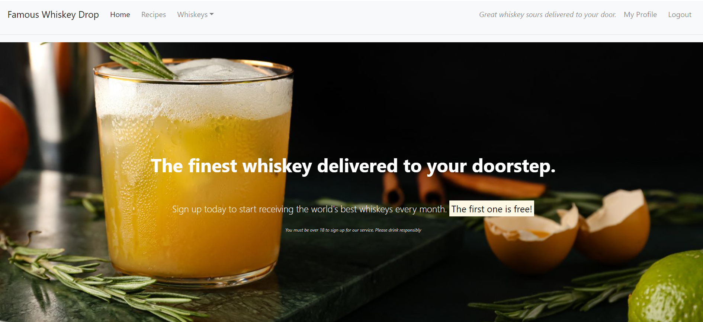
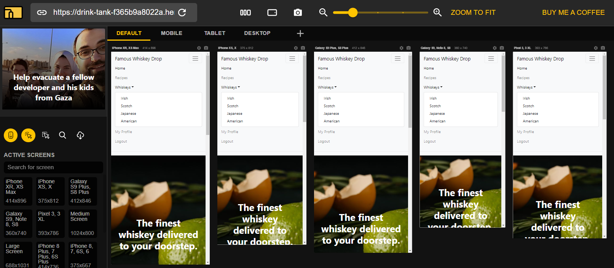
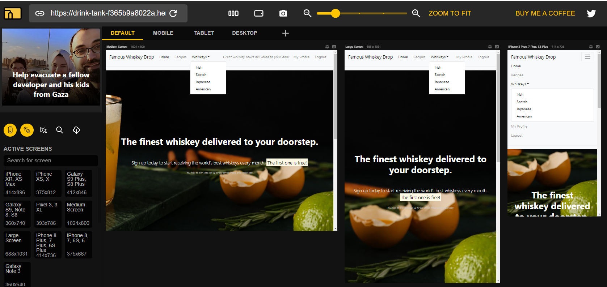
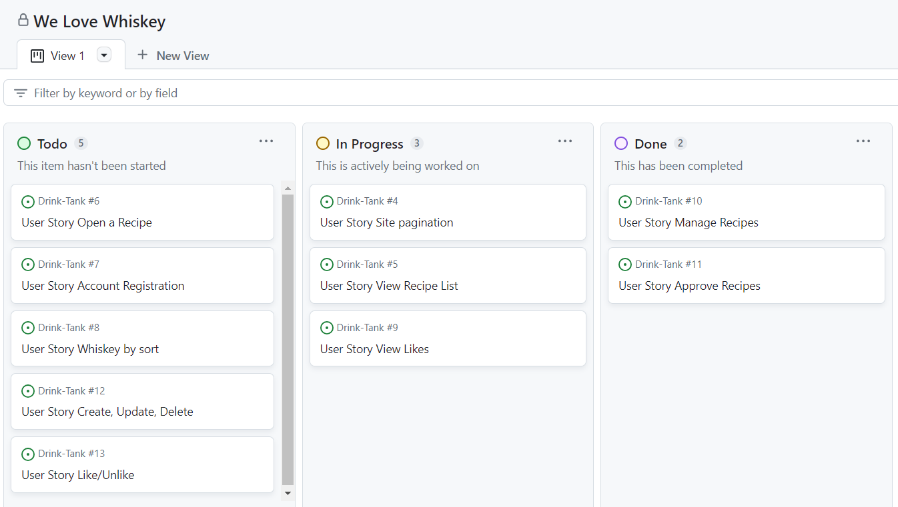
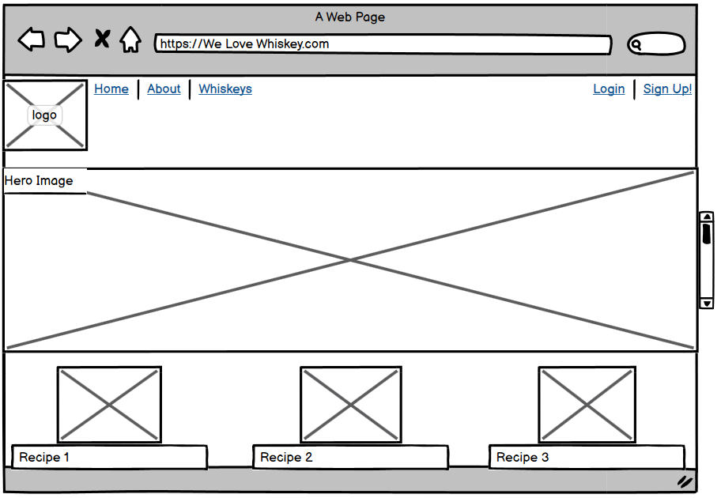
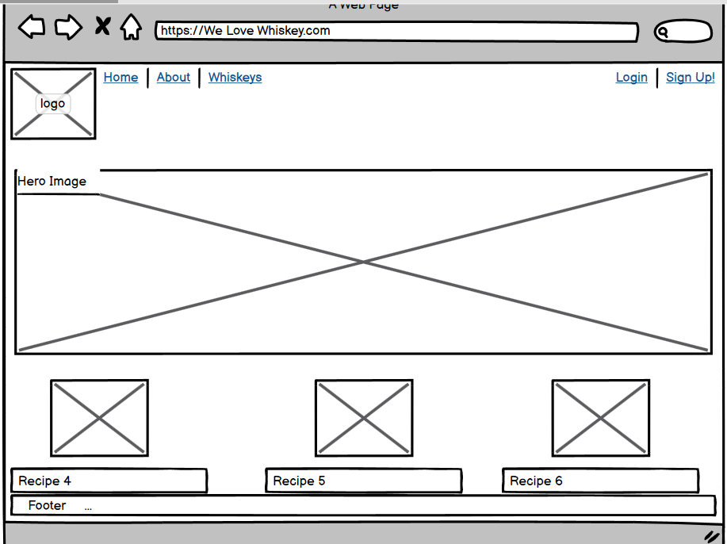
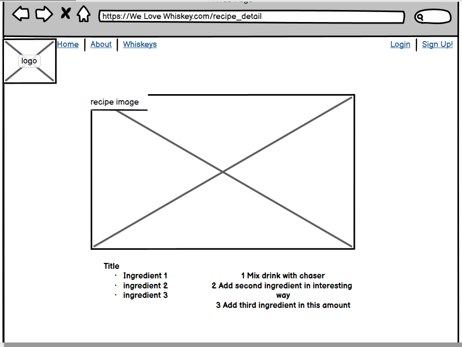
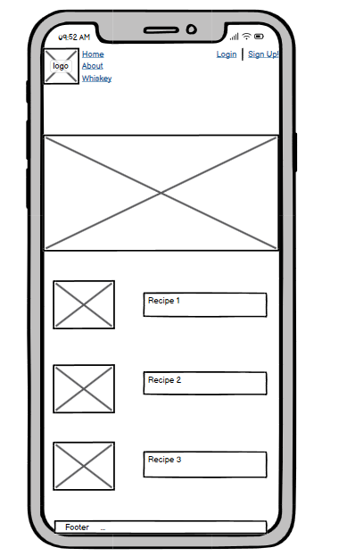
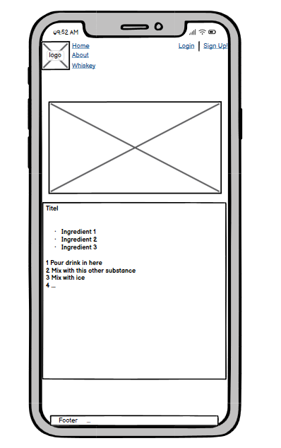
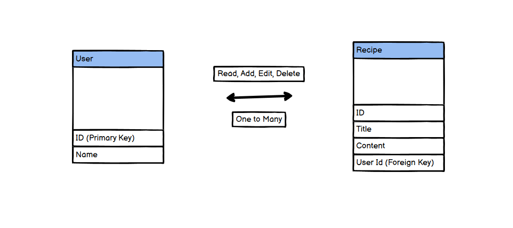

# Famous Whiskey Drop

Famous Whiskey Drop is a fictional recipe sharing site that allows bartenders and whiskey enthsiasts to join a community and share their best whiskey recioes. It allowy users to browse, upload, edit and delete their favorite whiskey recipes. Its simple and easy to use.

## Table of Contents

* User-Experience-Design
 * The-Strategy-Plane
   * Site-Goals
   * Agile Planning
     * Epics
     * User Stories
 * The-Scope-Plane
 * The-Structure-Plane
   * Features
   * Features Left To Implement
 * The-Skeleton-Plane
   * Wireframes
   * Database-Design
   * Security
 * The-Surface-Plane
   * Design
   * Colour-Scheme
   * Typography
   * Imagery
 * Technolgies
 * Testing
 * Deployment
   * Version Control
   * Heroku Deployment
 * Credits

 ## User Experience Design

 ### The Strategy Plane

 The site is aimed to help whiskey enthusiasts to easily share whiskey recipes on the website, and find recipes that they may never have tried before.

### Agile Planning

This project was developed using agile methodologies by delivering small features in incremental sprints. There were 3 sprints in total, spaced out evenly over four weeks.

All projects were assigned to epics, prioritized under the labels, Must have, should have, could have. They were assigned to sprints and story pointed according to complexity. "Must have" stories were completed first, "should haves" and then finally "could haves". It was done this way to ensure that all core requirements were completed first to give the project a complete feel, with the nice to have features being added should there be capacity.

The Kanban board was created using github projects and can be located here and can be viewed to see more information on the project cards. All stories except the documentation tasks have a full set of acceptance criteria in order to define the functionality that marks that story as complete.

#### Epics
The project had 7 main Epics (milestones):

##### EPIC 1 - Base Setup

The base setup epic is for all stories needed for the base set up of the application. Without the base setup, the app would not be possible so it was the first epic to be delivered as all other features depend on the completion of the base setup.

##### EPIC 2 - Site Navigation

The site navigation epic handles functions associated with the user navigation of the site.

##### EPIC 3 - Authentication Epic

The authentication epic is for all stories related to the registration, login and authorization of views. This epic provides critical functionality and value as without it the staff would not be able to managed the bookings securely without regular site visitors also being able to see and perform actions.

##### EPIC 4 - Deployment Epic

This epic is for all stories related to deploying the app to heroku so that the site is live for staff and customer use.

##### EPIC 5 - Documentation

This epic is for all document related stories and tasks that are needed to document the software development lifecycle of the application. It aims to deliver quality documentation, explaining all stages of development and necessary information on running, deploying and using the application.

#### EPIC 1 - Base Setup

As a developer, I need to create the base.html page and structure so that other pages can reuse the layout

As a developer, I need to create static resources so that images, css and javascript work on the website

As a developer, I need to set up the project so that it is ready for implementing the core features

As a developer, I need to create the footer with social media links and contact information

#### EPIC 2 - Site Navigation

As a developer, I need to create the navbar so that users can navigate the website from any device

As a developer, I need to implement links throughout the site

As a user, I would like a home page so that I can view recipes

#### EPIC 3 - Authentication Epic

As a developer, I need to implement allauth so that users can sign up and have access to the websites features

As a user, I want to register an account so that I can use member functionality

As a site owner, I would like the allauth pages customized to that they fit in with the sites styling

#### EPIC 4 - Deployment Epic

As a developer, I need to set up whitenoise so that my static files are served in deployment

As a developer, I need to deploy the project to heroku so that it is live for customers

#### EPIC 5 - Documentation

 Tasks:

* Complete readme documentation
* Complete testing documentation write up

### The Scope Plane

* Responsive Design - Site should be fully functional on all devices from 320px up
* Hamburger menu for mobile devices
* Ability to perform CRUD functionality on Menus and Bookings
* Restricted role based features
* Home page with basic site information

## The Structure Plane

### Features

User Story: As a **site user** I can **view a paginated list of recipes** so as to **pick which recipe I wish to view**

### Acceptance Criteria
* Recipes clearly displayed on landing page
* Clicking on a recipe opens it on a dedicated page

## Tasks
- [ ] Create view
- [ ] Create template
- [ ] Create model

User Story: As a **site admin** I can **create, update and delete recipes** so as to **manage site content**

### Acceptance Criteria
* Site admin user creation
* Site admin functionality

## Tasks
- [ ] Create admin user in Django
- [ ] Create recipes
- [ ] Edit recipes

User Story: As a **site user** I can **view a recipe list** so as to **select a recipe to view**

### Acceptance Criteria
* Viewer can go from landing page to recipe list page
* Recipes displayed asthetically on page

## Tasks
- [ ] Create view
- [ ] Create url
- [ ] Link to Home Page

User Story: As a **site user** I can **create, update and delete recipes** so as to **interact with community**

### Acceptance Criteria
* User can create recipes
* User can edit recipes
* User can delete recipes

## Tasks
- [ ] Create user profiles
- [ ] Assign functionality

User Story: As a **site user** I can **create an account** so as to **create, update and delete recipes**

### Acceptance Criteria
* User can login and log out
* User can create, update and delete recipes

## Tasks
- [ ] Create user app
- [ ] Create registration form
- [ ] Create "logged in" view with user functionality
- [ ] Create "logged in" url
- [ ] Create "logged in" and "logged out" messages

User Story: As a **site user** I can **open a recipe** so as to **view it in detail**

### Acceptance Criteria
* Clicking a recipe opens a dedicated page
* Details displayed asthetically

## Tasks
- [ ] Create View
- [ ] Create Url

## The Skeleton Plane

### Wireframes

### Database-Design

The database was designed to allow CRUD functionality to be available to registered users, when signed in. The user model is at the heart of the application.

### Security

Views were secured by using the django class based view mixin, UserPassesTextMixin. A test function was created to use the mixin and checks were ran to ensure that the user who is trying to access the page is authorized. Any user restricted functionality, user edit/delete functionality listed in the features was secured using this method.

Environment variables were stored in an env.py for local development for security purposes to ensure no secret keys, api keys or sensitive information was added the the repository. In production, these variables were added to the heroku config vars within the project.

## The Surface Plane

### Design

The design philosophy of Drink Tank is characterized by cleanliness, elegance, and minimalism. The primary focus is on presenting recipe cards prominently, providing users with a straightforward and visually appealing interface. Profiles take a secondary role, ensuring a user-friendly and uncluttered experience.

### Colour Scheme

Drink Tank employs a consistent and harmonious color scheme throughout the application. The chosen colors are carefully selected to complement each other, creating a visually pleasing environment. The color palette reflects the sophistication and richness associated with the world of whiskey.

### Typography

Consistency in typography is a key aspect of Drink Tank's design. The choice of fonts contributes to the overall aesthetic appeal and readability of the content. Fonts are selected to align with the elegant and refined theme of the application.

### Imagery

The imagery used in Drink Tank is curated to evoke a sense of quality and class, mirroring the essence of the whiskey culture. From the background images to the profile pictures, the visuals are chosen to enhance the overall user experience and convey a premium atmosphere.

The combination of design, color scheme, typography, and imagery collectively contributes to the surface plane of Drink Tank, creating an interface that is both aesthetically pleasing and user-focused.

### Technolgies
* HTML
  * The structure of the Website was developed using HTML as the main language.
* CSS
  * The Website was styled using custom CSS in an external file.
* JavaScript
  * JavaScript was used to make the custom slider on the menu page change and the bootstrap date picker.
* Python
  * Python was the main programming language used for the application using the Django Framework.
* Visual Studio Code
  * The website was developed using Visual Studio Code IDE
* GitHub
  * Source code is hosted on GitHub
* Git
  * Used to commit and push code during the development of the Website
* Favicon.io
  * favicon files were created at https://favicon.io/favicon-converter/
* balsamiq
  * wireframes were created using balsamiq from https://balsamiq.com/wireframes/desktop/#
* Python Modules Used

### Manual Testing System

To ensure the proper functionality of the application, perform the following manual tests:

#### 1. User Authentication

- **Signup:**
  1. Navigate to the signup page.
  2. Fill out the required fields, including a profile picture.
  3. Submit the form and verify that a new user account is created.

- **Login:**
  1. Access the login page.
  2. Enter valid credentials and click the login button.
  3. Confirm that the user is redirected to their profile page.

- **Profile Editing:**
  1. Log in as an existing user.
  2. Access the profile editing page.
  3. Modify the user's information and profile picture.
  4. Save changes and verify that the updated details are reflected on the profile page.

#### 2. Recipe Management

- **Add Recipe:**
  1. Log in as a user.
  2. Navigate to the "Add Recipe" page.
  3. Fill out the required fields for a new recipe.
  4. Confirm that the recipe is added to the user's profile.

- **Edit Recipe:**
  1. Log in as the recipe owner.
  2. Access the recipe editing page.
  3. Make changes to the recipe details.
  4. Save changes and verify that the modifications are visible.

- **Delete Recipe:**
  1. Log in as the recipe owner.
  2. Access the recipe deletion page.
  3. Confirm the deletion and check that the recipe is removed.

#### 3. Whiskey Articles

- **Read Articles:**
  1. Explore the different whiskey articles on the site.
  2. Confirm that articles are displayed correctly with relevant content.

#### 4. Responsive Design

- **Mobile Responsiveness:**
  1. Access the application from various devices (phone, tablet, desktop).
  2. Confirm that the layout adjusts appropriately for each screen size.

#### 5. Image Upload

- **Profile Picture Upload:**
  1. During signup, upload a profile picture.
  2. Verify that the image is saved and displayed on the user's profile.

#### 6. Static Content

- **Home Page Content:**
  1. Check that static content (quotes, features) is displayed correctly on the home page.

Use these manual tests to ensure the proper functioning and user experience of the application.

#### Python Modules Used
* Django Class based views (ListView, UpdateView, DeleteView, CreateView) - Used for the classes to create, read, update and delete
* Mixins (LoginRequiredMixin, UserPassesTestMixin) - Used to enforce login required on views and test user is authorized to perform actions
* messages - Used to pass messages to the toasts to display feedback to the user upon actions
* timedelta, date - Date was used in order to search for objects by date and timedelta for searching date ranges

#### External Python Modules

* cloudinary==1.29.0 - Cloundinary was set up for use but no custom uploads were made, settings remain for future development
* crispy-bootstrap5==0.6 - This was used to allow bootstrap5 use with crispy forms
* dj-database-url==0.5.0 - Used to parse database url for production environment
* dj3-cloudinary-storage==0.0.6 - Storage system to work with cloudinary
* Django==4.0.5 - Framework used to build the application
* django-allauth==0.51.0 - Used for the sites authentication system, sign up, sign in, logout, password resets ect.
* django-crispy-forms==1.14.0 - Used to style the forms on render
* gunicorn==20.1.0 - Installed as dependency with another package
* psycopg2==2.9.3 - Needed for heroku deployment
* python3-openid==3.2.0 - Installed as dependency with another package

### Deployment

#### Version Control

The site was created using the Visual Studio Code editor and pushed to github to the remote repository ‘Drink-Tank’.

The following git commands were used throughout development to push code to the remote repo:

git add <file> - This command was used to add the file(s) to the staging area before they are committed.

git commit -m “commit message” - This command was used to commit changes to the local repository queue ready for the final step.

git push - This command was used to push all committed code to the remote repository on github.

Heroku Deployment
The site was deployed to Heroku. The steps to deploy are as follows:

Navigate to heroku and create an account
Click the new button in the top right corner
Select create new app
Enter app name
Select region and click create app
Click the resources tab and search for Heroku Postgres
Select hobby dev and continue
Go to the settings tab and then click reveal config vars
Add the following config vars:
SECRET_KEY: (Your secret key)
DATABASE_URL: (This should already exist with add on of postgres)
EMAIL_HOST_USER: (email address)
EMAIL_HOST_PASS: (email app password)
CLOUNDINARY_URL: (cloudinary api url)
Click the deploy tab
Scroll down to Connect to GitHub and sign in / authorize when prompted
In the search box, find the repositoy you want to deploy and click connect
Scroll down to Manual deploy and choose the main branch
Click deploy
The app should now be deployed.

The live link can be found :[here](https://drink-tank-f365b9a8022a.herokuapp.com/) Live Site

Run Locally
Navigate to the GitHub Repository you want to clone to use locally:

Click on the code drop down button
Click on HTTPS
Copy the repository link to the clipboard
Open your IDE of choice (git must be installed for the next steps)
Type git clone copied-git-url into the IDE terminal
The project will now have been cloned on your local machine for use.

### Credits

This project was developed with the help of various resources, tutorials, and documentation. Special thanks to the following:

- [Code Institute](https://codeinstitute.net/) - Learning materials and tutorials, including the "I Think, Therefore I Blog" tutorial.
- [Django Documentation](https://docs.djangoproject.com/) - Official documentation for the Django web framework.
- [Liquor.com](https://www.liquor.com/) - Inspiration and reference for whiskey-related content.

Additionally, thanks to the open-source community for their contributions to the tools and libraries used in this project.

